# ES增删改查

## 创建索引

> 创建一个指定类型并且带数据的索引


> 创建一个空索引，并指定各个字段的类型

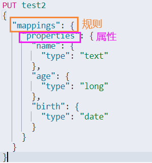

> 得到索引库信息

``` Bash
GET test2
```

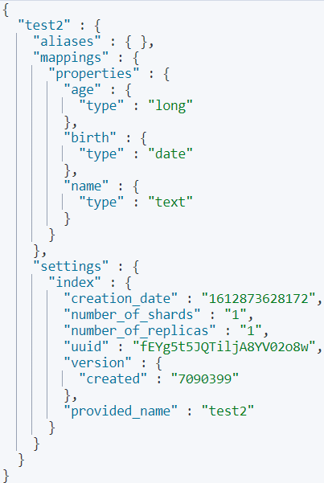

> 创建一个默认类型并且带数据的索引

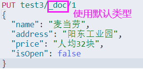

> 查看该索引库信息

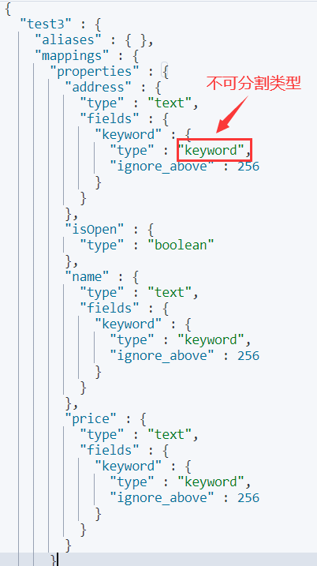

> 查看所有库信息

``` Bash
GET _cat/indices?v
```

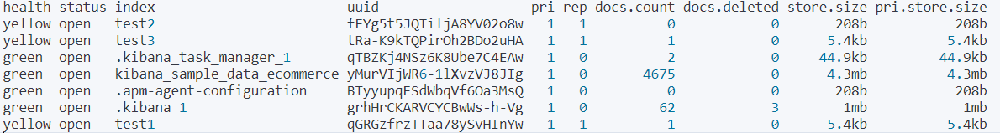

## 修改索引

### 覆盖型修改

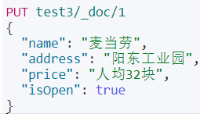

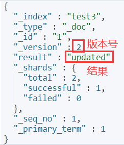

### 指定型修改

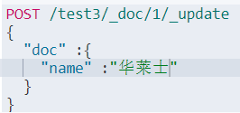

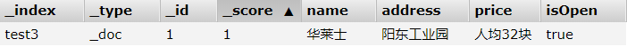

## 删除索引

``` Bash
DELETE test1
```

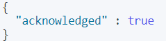

## 花式查询

### 以文档的名字简单查询

``` Bash
GET test3/_doc/4
```

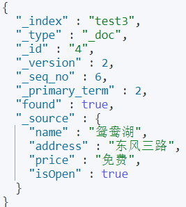

### 绑定权重与关键词有关的索引全查询

``` Bash
GET test3/_doc/search?q=address:路
```

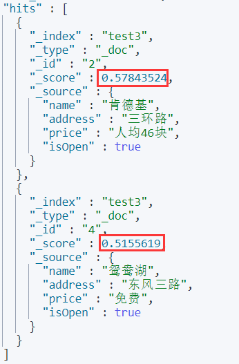

``` Bash
GET test3/_doc/search?q=address:三环路
```

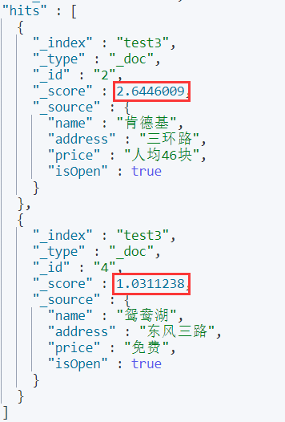

### 条件的匹配

> match是使用了分词器

> 分词在数组里面都有效

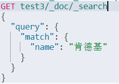

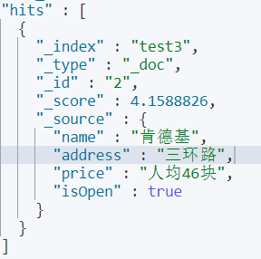

> 结果的过滤

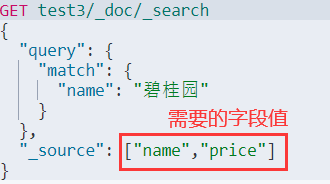

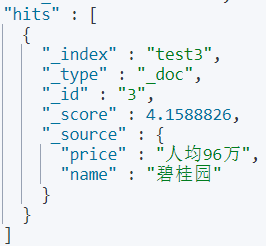

> 降序排序


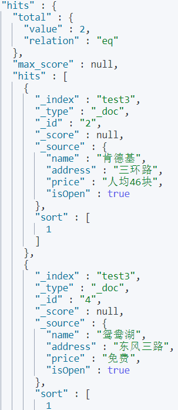

> 分页查询

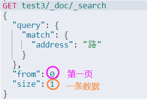

> 必须包含查询

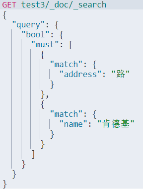

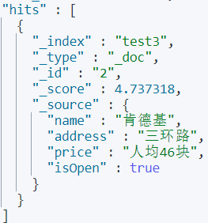

> 只要满足指定匹配的全查询

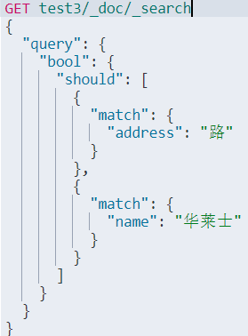

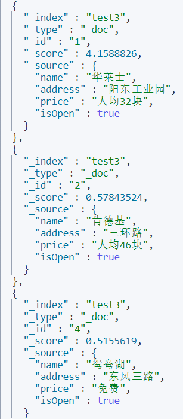

> 必须不包含查询

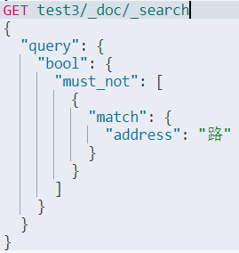

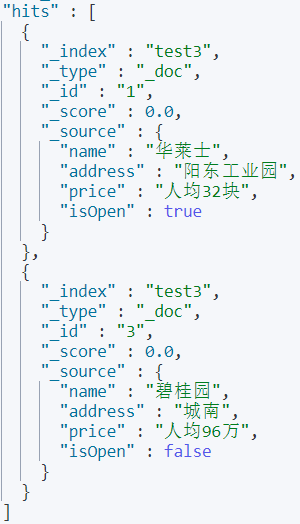

> 过滤器

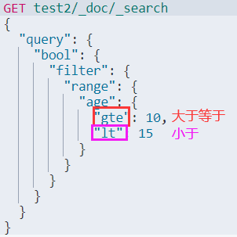

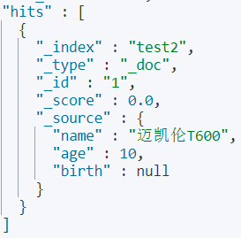

> 不分词查询

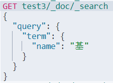

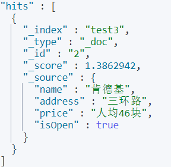

> 高亮查询

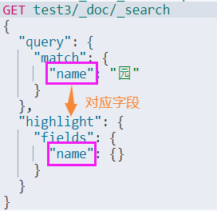

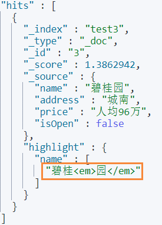

> 自定义高亮查询


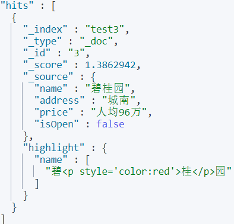


