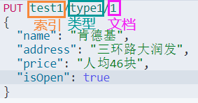
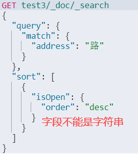

# ES增删改查

## 创建索引

> 创建一个指定类型并且带数据的索引



> 创建一个空索引，并指定各个字段的类型


> 得到索引库信息

``` Bash
GET test2
```


> 创建一个默认类型并且带数据的索引


> 查看该索引库信息


> 查看所有库信息

``` Bash
GET _cat/indices?v
```


## 修改索引

### 覆盖型修改


### 指定型修改


## 删除索引

``` Bash
DELETE test1
```


## 花式查询

### 以文档的名字简单查询

``` Bash
GET test3/_doc/4
```


### 绑定权重与关键词有关的索引全查询

``` Bash
GET test3/_doc/search?q=address:路
```


``` Bash
GET test3/_doc/search?q=address:三环路
```


### 条件的匹配

> match是使用了分词器

> 分词在数组里面都有效


> 结果的过滤


> 降序排序




> 分页查询


> 必须包含查询


> 只要满足指定匹配的全查询


> 必须不包含查询


> 过滤器


> 不分词查询


> 高亮查询


> 自定义高亮查询


